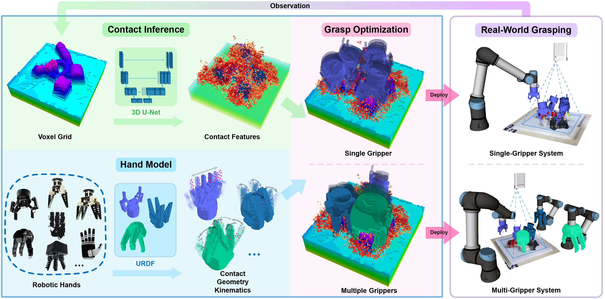
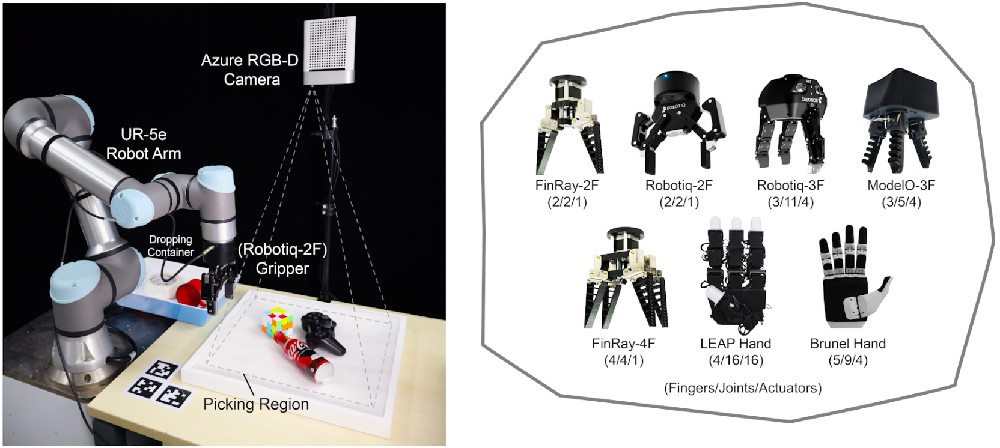

# SpaHybGen: Scene-Level Spatial Grasp Generation for General Robotic Hands
SpaHybGen Generates grasp poses for general grippers in SE(3) clutter scenes using learning and optimization strategies. It uses the real grasping dataset GraspNet-1Billion to train the inference section. SpaHybGen can directly and robustly deploy any robotic hand with its URDF to actual clutter grasping in minutes, using a single depth camera.

> It is feasible to use your own robotic hands **without** steps of dataset generation and contact training. To immediately use any grippers, directly see [Pipeline: Grasp Generation](#pipeline-grasp-generation) (of course, after setting up the [Code Environment](#code-environment)).

<figure>
  <div align="center">
    
  </div>
  <div align="center">
    <figcaption><b>Pipeline of SpaHybGen</b></figcaption>
  </div>
</figure>

<br>
<br>

<figure>
  <div align="center">
    <a href="https://www.youtube.com/watch?v=fSxkLJ2piVI">
      
    </a>
  </div>
  <div align="center">
    <a href="https://www.youtube.com/watch?v=fSxkLJ2piVI">
      <figcaption><b>Video: Grasping performance for seven robotic hands</b></figcaption>
    </a>
  </div>
</figure>


## Code Environment
We use Python 3.8 in Conda to train 3D U-Net, infer contacts, and optimize grasps.
All algorithmic procedures are coded in Pytorch and [Pytorch_kinematics](https://github.com/UM-ARM-Lab/pytorch_kinematics). 
Environment setup for the real-world deployment refers to the following [Actual Grasping](#actual-grasping) section.

0. Create virtual env.: 
```bash
conda create --name spahybgen python=3.8
conda activate spahybgen
```
1. Install required packages with `pip` on virtual env or python3:
```bash
pip install -r ./assets/requirements.txt

export SKLEARN_ALLOW_DEPRECATED_SKLEARN_PACKAGE_INSTALL=True # for sklearn package error
pip install graspnetAPI # for Graspnet Dataset
```

2. Build and source the catkin workspace, or alternatively install the project locally in "editable" mode using pip: `pip install -e .` install of the following lines:
```bash
catkin build spahybgen
source /path/to/catkin_ws/devel/setup.sh
```

> We realize that the setup of conda env. for GPU-based packages can be tricky in specific machines. The above instructions are probably insufficient for an error-free installation. Thus, we further share the specification of our installed env. in [environment.yml](assets/environment.yml) for debugging.


## Dataset Generation
We release the generated contact dataset in [Google Drive](https://drive.google.com/drive/folders/1hs88Nh3Kx85hMYPT0tjwxXlCzFibeEXJ?usp=sharing).
If researchers expect to generate it with [GraspNet-1Billion](https://graspnet.net/datasets.html), please download the full GraspNet-1Billion dataset and run the following command:
```bash
python scripts/generate_dataset.py 
```
It will take tens of hours for the generation process (currently we have not parallelized it). Detail descriptions of the contact generation are found in [scripts/generate_dataset.py](scripts/generate_dataset.py).

The contact dataset should be placed inside a `dataset` folder as: `spahybgen\dataset\train`.

## Network Training 
To train a 3D U-Net using the generated contact dataset, run:
```bash
python scripts/train_shgn.py --dataset dataset/train/ --net unet --orientation quat --gridtype voxel --batch-size 4 --numsample 3000 --epochs 64 --loaders 10 --gridtype voxel
```

The training logs and models are stored at `data/runs/`.

To facilitate reproduction, two trained models are also shared in [Google Drive](https://drive.google.com/drive/folders/1hs88Nh3Kx85hMYPT0tjwxXlCzFibeEXJ?usp=sharing) and [assets/trained_models/](assets/trained_models/). 
It contains two networks oriented to Voxel and TSDF input observations.

## Pipeline: Grasp Generation
The **grasp generation** process includes `1.scene observation`, `2.contact inference`, and `3.grasp optimization`. We elaborate on these three parts below:
### 1. Scene Observation
We enable two formats (Voxel and TSDF) as the scene observation in actual grasping tasks. To obtain observation, one can refer to the generated (downloaded) contact dataset in folder `spahybgen/dataset/`, where the `.npz` files are observations for grasping scenes in GraspNet-1Billion. 
Alternatively, practitioners capture scene volumes using a depth sensor, following the sensing pipeline at [src/spahybgen/pipeline/sensor_server.py](src/spahybgen/pipeline/sensor_server.py). 
> Two observation samples can be found in [assets/observations/](assets/observations/). You can load them with `np.load('assets/observations/scene_010_ann_0124_voxel.npz')["grid"]`.

### 2. Contact Inference
With the `trained model` and obtained `observation`, dense contact features can be reasoned before grasp optimization.
> If you want to individually test the `contact inference` module, run `python scripts/contact_inference_test.py`. It will infer contact features using the observation `scene_010_ann_0124_voxel.npz` and model `spahybgen_unet_64_voxel.pt` in folder [assets/](assets/).

### 3. Grasp Optimization
With the inferred `contact features` and established [hand model](handmodel/), grasp optimization is parallelized using [Pytorch_kinematics](https://github.com/UM-ARM-Lab/pytorch_kinematics).
> If you want to individually test the `grasp optimization` module, download the `std_inference_result_from_clutter.npy` from [Google Drive](https://drive.google.com/drive/folders/1hs88Nh3Kx85hMYPT0tjwxXlCzFibeEXJ?usp=sharing) to the folder `assets\`. Then run `python scripts/grasp_optimization_test.py`. 

### **Full Pipeline**
To run the full generation pipeline without hardware, please directly run (using the default observation file and trained model contained in folder [assets/](assets/)):
```bash
python scripts/generation_pipeline_test.py
```
It will optimize grasps using Robotiq-2F and visualize the results using Web-based Plotly.


## Actual Grasping
<figure>
  <div align="center">
    
  </div>
  <div align="center">
    <figcaption><b>Used devices in actual grasping</b></figcaption>
  </div>
</figure>

- In our actual grasping experiments, ROS Melodic is used to coordinate the UR-5e, Azure RGB-D camera, and multiple robotic hands. To facilitate a fast setup of the actual grasping framework, we released the ROS-based communication interfaces of all devices and algorithm modules, as in the folder [src/spahybgen/pipeline/](src/spahybgen/pipeline/).

- Practitioners are expected to set up the custom hardware with ROS and modify their specific ROS topics in different files (camera: [config/grasp_generation.yaml](config/grasp_generation.yaml); robot arm:[src/spahybgen/pipeline/pose_node.py](src/spahybgen/pipeline/pose_node.py); robotic hands: [src/spahybgen/pipeline/gripper_node.py](src/spahybgen/pipeline/gripper_node.py)). 

- Finally, [scripts/realrobot_execution.py](scripts/realrobot_execution.py) details a single-gripper grasping pipeline which includes hardware execution.

> To enable ROS1 in Python3, please follow [Coding_Instruction](https://github.com/wangzivector/Coding_Instruction/blob/master/ROS_python3.md) to make `import rospy` and `import tf2_ros` working in python3.


## Acknowledge
This project is inspired by the following excellent works [VGN](https://github.com/ethz-asl/vgn), [GenDexGrasp](https://github.com/tengyu-liu/GenDexGrasp), and [GraspNetAPI](https://github.com/graspnet/graspnetAPI).